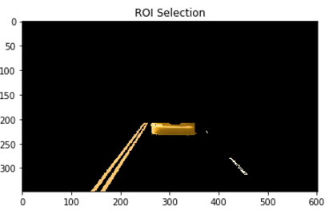

# **Finding Lane Lines on the Road**
 

## Overview

When we drive, we use our eyes to detect surrounding environment. The lines on the road act as a reference for us to decide where to drive. For a self-driving car to know where to steer, it must have eyes to detect lane lines. In this project, I design a simple algorithm to detect lane lines (in limited situations).

This project is forked from Udacity Self-Drving Cars Nanodegree program. For more information, please visited <https://github.com/udacity/CarND-LaneLines-P1>.

## Sample Result
 


## Algorithm Details

This lane lines detection algorithm use traditional digital image processing tools. The pipeline inclues 5 steps:

1. __Color Selection__. Road lane lines are white or yellow. We can filter out other colors.
2. __Region Selection__. Lane lines are almost in front of the car. Specifically, only a quadrilateral region shoud be considered.
3. __Edge Detection__. Edge detection algorithm should be applied before line detection. Canny edge detector is used in this step.
4. __Line Detection__. Hough Transformation is used to detect lines in image. After this steps, only meaningful lines are kept in image.
5. __Line Combination__. Steps 4 may detect multiple lines in images. To make our output more easy to understand, lines need to be merged into two lane lines.

### Step 1. Color Selection

In this step, the algorithm need to select white or yellow color pixels. I found [HSL](https://en.wikipedia.org/wiki/HSL_and_HSV) space is more suitable than RGB space to select this pixels.
Following two graph visualized HSL space in two dimensions. According to this images, white color should have high lightness value. Yellow color should have hue value around 20 and a high value of saturation. 


```python
hls_img = cv2.cvtColor(img, cv2.COLOR_RGB2HLS)
color_white_mask = cv2.inRange(hls_img,
    np.array([0, 200, 0]),
    np.array([180, 255, 50])
    )
color_yellow_mask = cv2.inRange(hls_img,
    np.array([15, 50, 150]),
    np.array([25, 255, 255]))
color_mask = cv2.bitwise_or(color_white_mask, color_yellow_mask)
color_select_img = cv2.bitwise_and(img, img, mask=color_mask)
```

We can set threshold to detect pixels. The result shows our definition of white or yellow is strict. Don't worry about that! In most situation, lane lines contains a great number of pure white or yellow pixels. We can perform hough transformation to find those lines.


### Step 2. Region Selection

When camera is fixed on the car, lane lines should appear in a limited range of pictures. We can cut off non-necessary parts of image. In this algorithm, we focus on a quadrilateral region which is show below.

```python
x_size, y_size = img.shape[1], img.shape[0]
roi_vertices = np.array([[
    (x_size * .05, y_size), (x_size * .4, y_size * .6),
    (x_size * .6, y_size * .6), (x_size * .95, y_size)]],
    dtype=np.int32)
roi_mask = cv2.fillPoly(
    np.zeros_like(color_select_img), 
    roi_vertices, [255, 255, 255])
roi_select_img = cv2.bitwise_and(color_select_img, roi_mask)
```


When we combining step 1 and setp 2, a prototype of our algorithm has been done.


### Step 3. Edge Detection

In order to find lines, we must remove some noise in image. Lines have sharp edges, we can use canny algorithm to detect edge and remove uncessary noise. Beftore that, a gaussian blur is aplied. We make the assumption that a pixel should be white or yellow if its surround pixels are of the same color, which are parts of lane lines.

```python
gray_img = grayscale(roi_select_img)
blur_img = gaussian_blur(gray_img, 7)
canny_img = canny(blur_img, 30, 100)
```


### Step 4. Hough Transformation

Finally, we need to find "lines". Hough transformation is pretty well in doing this. We use the probability version of hough transformation which in opencv is `HoughLinesP`.

```python
lines = cv2.HoughLinesP(
    canny_img, rho=1, theta=np.pi/180, threshold=15, 
    minLineLength=5, maxLineGap=3)
lines = np.reshape(lines, [-1, 4])
hough_img = np.zeros((img.shape[0], img.shape[1], 3), dtype=np.uint8)
if lines is not None:
    for line in lines:
        x1, y1, x2, y2 = line
        cv2.line(hough_img, (x1, y1), (x2, y2), 
             color=[255, 0, 0], thickness=2) 
```


Looks like hough transformation find many small lines rather than 2 big lines. In next steps, we merge those lines.

### Step 5. Line Average

To merge small lines, we further make another assumption. Only lane lines are kept in hough image. 
Each line can be represent as `y = ax + b`. We just calculate the average of `a` and `b` in left of right parts of image. Normally, left lane lines have negative slope `a` and right lane lines have positive slope `a`. We can use the value of `a` to select the left/right lines. After that, lines can be merge seperately.

```python
left_lines = [line for line in lines if -3 <= get_slope(line) <= -0.3]
right_lines = [line for line in lines if 0.3 <= get_slope(line) <= 3]
left_merge = line_merge(left_lines, img)
right_merge = line_merge(right_lines, img)

line_img = np.zeros((img.shape[0], img.shape[1], 3), dtype=np.uint8)
left_merge = line_merge(left_lines, img)
right_merge = line_merge(right_lines, img)
if left_merge is not None:
    cv2.line(line_img,
        (left_merge[0], left_merge[1]),
        (left_merge[2], left_merge[3]),
        color=[255, 0, 0], thickness=15)
if right_merge is not None:
    cv2.line(line_img,
        (right_merge[0], right_merge[1]),
        (right_merge[2], right_merge[3]),
        color=[255, 0, 0], thickness=15)
line_img = cv2.bitwise_and(line_img, roi_mask)
```


Drawbacks
---
This algorithm has many assumptions:

1. Color: Anything is white or yellow is considered. So color attack can be applied.
2. Region: Lane lines should be in the region we defined. If the car is switching lines, some error could be occurred.
3. Lightness: Many existing image processing algorithms are fragile when the lightness condition is changed.

### Color Attack

Let's do the attack on our algorithm.





The algorithm failed in color selection and roi step. It cut off the front yellow car pixels as candidate sets. Fortunately, our algorithm not failed in final steps. Because lines are constraint in specific range. If the car closer to us, the result may be different.


### Region Attack

If lane lines not in our region, our algorithm may fail. Let's trick our algorithm.


Our region failed to detect the right lane lines.


### Lightness Attack


Aha. The algorithm fails at the first stage. It can't detect white and yellow pixels in night.


